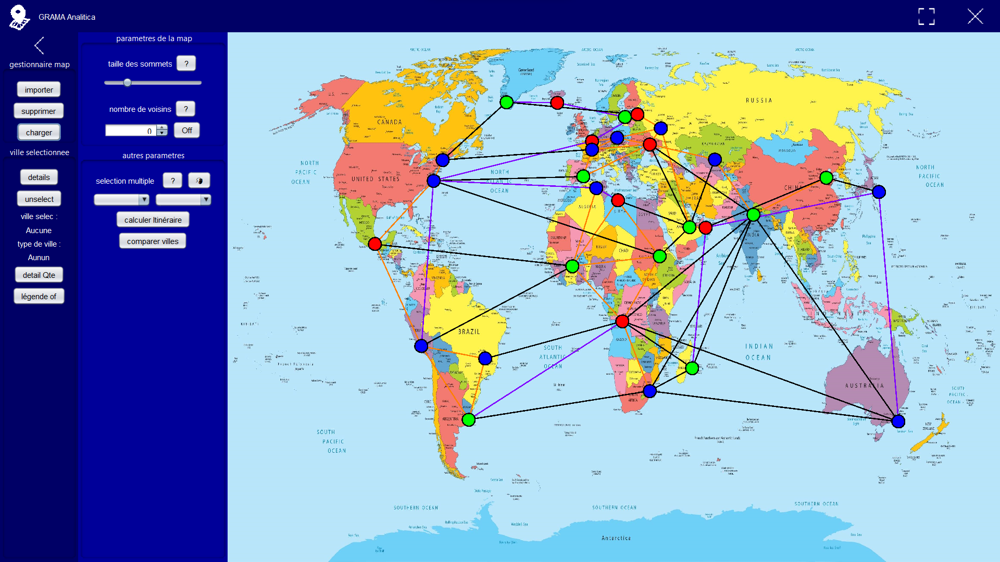
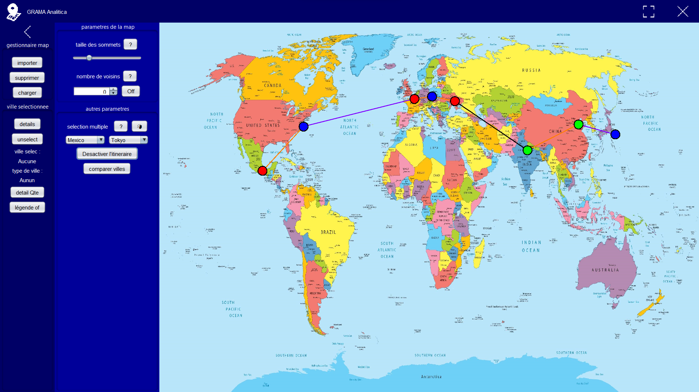

# SAE Graph Map Analysis

## Project presentation

This project is a java application developped during my first year of BUT info at [IUT Lyon 1](https://iut.univ-lyon1.fr/). This application imprements a graph manager which handles in particular the search for the shortest path, the comparison of vertices and the customization of the graph
The repository contains a executable of the app and the source code with all the commits process. There is also a .txt file who contains an example of the data needed to load a graph.

## Try it now

You can clone the repository and play with the sample data provided.

The data is formatted line by line and must be imported when the application is opened. they are stored in [this document](./ressources/SAE_graph.txt "text file").

## Visuals of the application

 - This is the main screen of the application, it allows you to view the entire graph at once :

    

- Here is also a visuel but with a way selected :

    

## Authors

**Mathis Guerin**

- [ ] [My GitHub](https://github.com/Hubrec)
- [ ] [My Linkedin](https://www.linkedin.com/in/mathis-guerin-43b228222/)

## License

This project is open source.

## Project status

The development of the project is closed for the moment and offers a stable version
